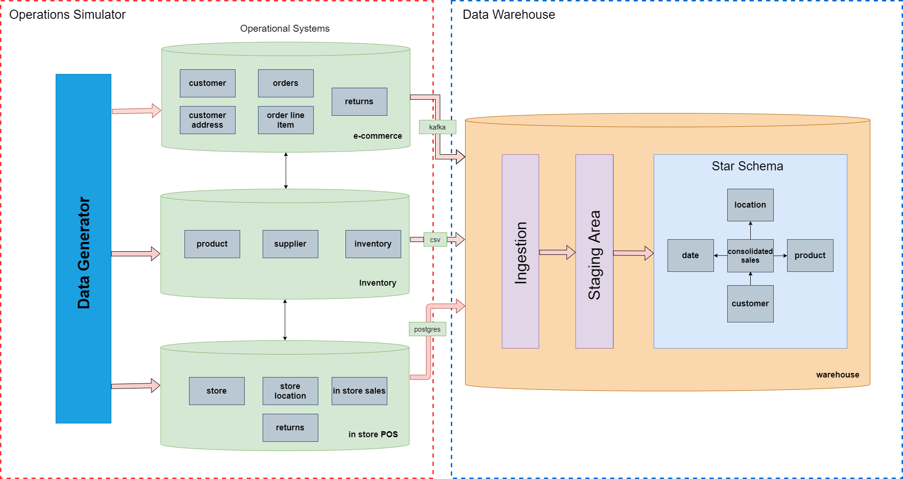
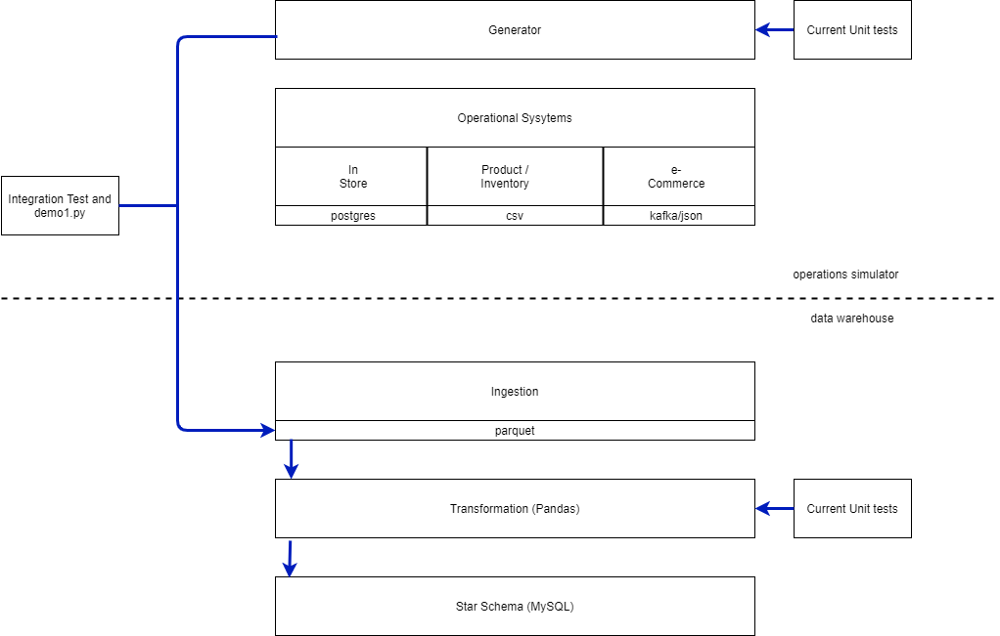

##  Widgets Unlimited - A data warehousing simulation

### Background:   
Widgets Unlimited is a company that sells widgets via an e-commerce website and in physical retail stores.   
They have three operational systems that support the business: inventory, e-commerce, and in-store.

### Problem: 
The company needs accurate and timely sales information captured by these operational systems to support marketing and
pricing decisions.  The systems have some limited reporting capabilities, but they do not consolidate sales across 
e-commerce and physical stores or support ad-hoc queries. It is determined that changes to the systems 
may be captured as follows: inventory via csv file (daily); e-commerce via kafka topic (continuously); and in-store via
postgres database (daily).

### Proposal: 
Build a data warehouse which will extract data from the operational systems and transform it into an 
analysis-friendly star schema format.

### Operational Systems and Data:
This project includes a data generation component.  Datasets of commercial operational data may not be freely available
and synthesized data is convenient for demonstrating cleaning and harmonization use cases.  Classes representing the
operational system process the generated data and expose it as incremental updates, to be consumed by the data 
warehouse in different formats.  An operations simulator ties this together by repeatedly calling the data generator 
and passing the new or modified records to the operational systems.

### Goals: 
A successful implementation of the data warehouse will ingest initial and incremental loads, clean data errors, and 
harmonize the differences in the operational systems. In particular, date and location information will be 
standardized and the sales facts from the e-commerce and physical stores will be combined into a single fact table.  
An orchestration layer will coordinate ingestion for the three source systems and trigger the transformations which 
update the star schema.

### Tools:
 - Languages: python, sql, pandas
 - Databases: Postgres, mySQL
 - Messaging: Kafka
 - Containerization:  Docker
 - Orchestration: Airflow

Widgets Unlimited Operational Systems and Warehouse

### Project structure

The source code is divided into three packages:

- operations - data generation and exposure (red rectangle)
- warehouse - data ingestion and transformation (blue rectangle)
- model - modules used by both operations and warehouse for the entities and metadata

### Components

### Data Model
The entities are split among the operational systems as follows: 

e-Commerce
- customer
- customer_address
- loyalty_number
- order
- order_line_item

Inventory 
- inventory
- supplier
- product

In-Store
- store
- store_location
- store_sales

Table and Column classes (WidgetsUnlimited.model.metadata.py) describe the layout of these entities 
and hold attributes that are used by the Data Generator and other aspects of the simulation.

### Data Generator
The DataGenerator (WidgetsUnlimited.operations.generator.py) synthesizes sample data for entities modeled by 
Table classes in WidgetsUnlimited.model. When processing a GeneratorRequest, it applies inputs and updates to 
a postgres database (maintaining cumulative state) and returns inputs and updates to the caller, which are then 
routed to the associated operational system.

### Operational Systems
The operational systems accept new and changed data from the generator for the entities they host and then represent 
the data in a way that the warehouse can ingest as an incremental update.  The semantics, formats and schedule are 
specific to the individual system (and its paired ingestion in the warehouse).

### Operations Simulator
The operations simulator is the driver program which passes Generator Requests to the generator 
and forwards the resulting data to the operational systems.

### Ingestions
There is one data warehouse ingestion per operational system whose extraction method is aligned with that system.
The ingested data are reformatted as parquet files and written to a staging area.

### Transformations
Transformations update the star schema to incorporate incremental changes in the source systems. The star schema for
Widgets Unlimited is made up of five tables, four dimension tables and one fact table. Each of these tables has 
an associated transformation which takes as input the staged incremental data and the current state of the star schema.
The output of the transformation is an updated dimension or fact table.  

### Orchestration
The data warehouse defines the cadence of updates to the star schema.  Data will be ingested independently for each 
source system. Only after all ingestions are complete in a given cycle are the transformations run.

### Containers
The Widgets Unlimited project is partitioned in three docker containers

- Infrastructure - postgres, mysql, kafka
- Operations - Operations Simulator, DataGenerator, Operational Systems
- Warehouse - Ingestions, Transformation, Orchestration (container not yet available)

### Phased Rollout
The project will roll out with the following milestones.  A demo will accompany each phase.

    1. Simulation infrastructure, Data Generator and Customer Dimension transformation
    2. Transformations of remaining dimensions and facts
    3. Operational Systems and Ingestions (synchronous one container)
    4. Synchronous separate containers
    5. Cloud Deployment
    6. Asynchronous Orchestration

### Install and run the demo

### Prerequisites: 
The simulation will run in any environment with docker, docker-compose and python venv.  
The development environment is:

 - ubuntu 20.04 
 - python 3.8.10
 - python3.8-venv  
 - docker 2.10.8
 - docker-compose 1.25.5

### Installation steps

1. python3 -m venv ~/virtualenvs/open-ended-capstone
1. source ~/virtualenvs/open-ended-capstone/bin/activate
1. git clone https://github.com/AlanHorowitz/open-ended-capstone.git
1. cd open-ended-capstone
1. docker network create widgets-unlimited-network
1. docker network inspect widgets-unlimited-network | grep Gateway
1. if gateway host shown is not 172.18.0.1, edit config.sh to change the host to the shown ip address
1. source config.sh
1. docker-compose -f docker-compose-db.yaml up -d
1. pip install -r requirements-operations.txt 

### demo1 description
WidgetsUnlimited/demo1.py demonstrates the functionality of phase #1. Fours days of operational input data are created 
and processed by the data warehouse (customer dimension only). Log records show the progress of the processing within 
the simulation.  Unit tests and an integration test may also be one.  
The following diagram illustrates the data flows as built out in phase #1.

### To run demo1.py

1. cd ~/open-ended-capstone/WidgetsUnlimited
1. python3 demo1.py

### To run tests

1. cd ~/open-ended-capstone/tests
1. pytest

### To run demo1.py in a docker container

1. cd ~/open-ended-capstone
1. docker-compose build
1. docker-compose up

